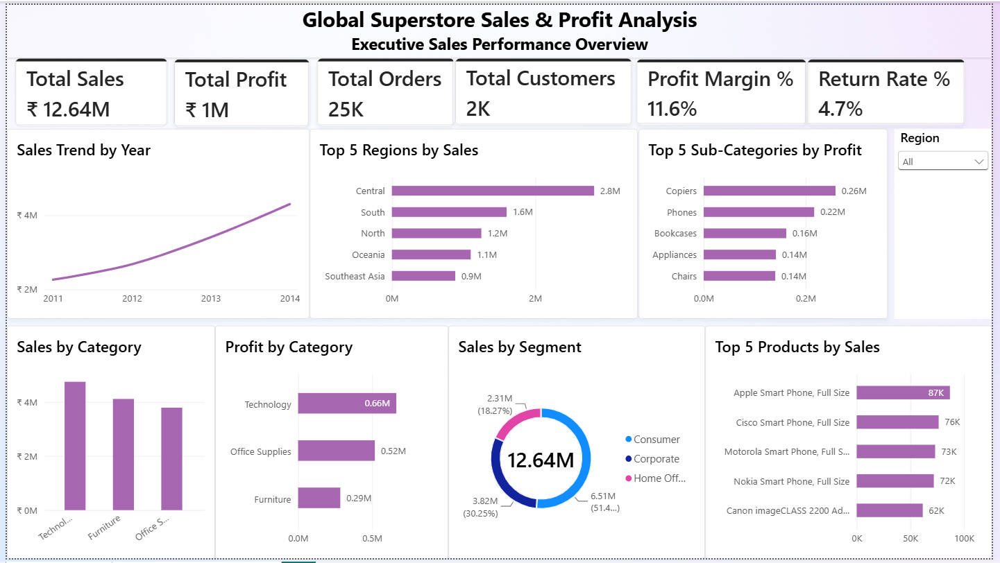
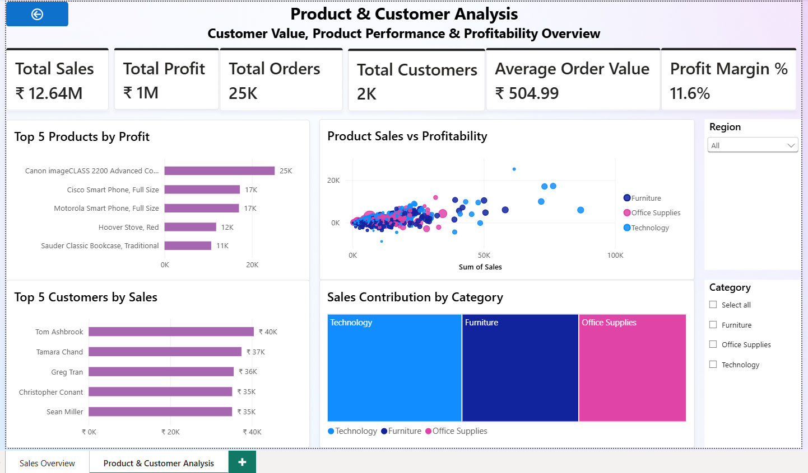

## Global Superstore Sales & Profit Analysis – Power BI

## 📊 Project Overview

An interactive Power BI dashboard developed to analyze sales, profit, customers, products, categories, segments, and regional performance using the Global Superstore dataset.

The dashboard provides an executive-level overview of business performance and helps identify key sales and profitability trends.

## 🎯 Business Objectives

- Analyze overall sales and profitability
- Track sales and profit trends over time
- Identify top-performing regions
- Analyze category and sub-category performance
- Identify top customers and products
- Compare sales and profitability across products
- Understand customer and segment contribution
- Monitor key business KPIs

## 📌 Dashboard Pages
### 1. Sales Overview

Provides an executive summary of overall business performance.

which includes:
- Total Sales
- Total Profit
- Total Orders
- Total Customers
- Profit Margin
- Return Rate
- Sales Trend by Year
- Top Regions by Sales
- Top Sub-Categories by Profit
- Sales by Category
- Profit by Category
- Sales by Segment
- Top 5 Products by Sales

**Interactive feature:**
- Region slicer for dynamic filtering

## 🔍 Key Insights

- The dashboard provides an overall view of sales and profitability, with total sales of approximately ₹12.64M and an overall profit margin of 11.6%.
- The Consumer segment contributes the largest share of overall sales compared with the Corporate and Home Office segments.
- The Technology category makes a significant contribution to overall sales and profitability.
- The Central region is one of the leading regions in terms of sales performance.
- Copiers are among the strongest-performing sub-categories in terms of profit.
- The Top 5 product and customer analyses help identify the products and customers contributing significantly to overall business performance.
- The Sales vs. Profitability scatter plot helps identify products with strong sales and profitability as well as products where high sales do not necessarily translate into high profit.
- Interactive Region and Category slicers allow users to explore these patterns dynamically.

#### Dashboard Preview

### 2. Product & Customer Analysis

Focuses on product performance, customer value, and profitability.

Key insights include:
- Total Sales
- Total Profit
- Total Orders
- Total Customers
- Average Order Value
- Profit Margin
- Top 5 Products by Profit
- Product Sales vs Profitability
- Top 5 Customers by Sales
- Sales Contribution by Category
  
 **Interactive features:**
- Region slicer
- Category slicer
- Product sales vs. profitability scatter plot
- Page navigation between dashboard pages

#### Dashboard Preview

## 🛠️ Tools & Technologies

## 🛠️ Tools & Technologies

- **Microsoft Power BI Desktop** — Dashboard development and data visualization
- **Power Query** — Data cleaning and transformation
- **DAX** — Measures and KPI calculations
- **Data Modeling** — Relationships between tables
- **Interactive Slicers** — Dynamic filtering
- **Business Intelligence** — Business-focused analysis and reporting

## 📈 Key KPIs

| KPI | Value |
|---|---:|
| Total Sales | ₹12.64M |
| Total Profit | ₹1M |
| Total Orders | 25K |
| Total Customers | 2K |
| Average Order Value | ₹504.99 |
| Profit Margin | 11.6% |
| Return Rate | 4.7% |

## 🔍 Key Skills Demonstrated

- Data cleaning and transformation using Power Query
- Data modeling and table relationships
- DAX measures
- KPI development
- Interactive dashboard design
- Data visualization
- Business-oriented data analysis
- Slicers and filtering
- page navigation
- Insight generation

## 🔄 Project Workflow

1. Imported the Global Superstore dataset into Power BI.
2. Cleaned and transformed the data using Power Query.
3. Prepared the tables and established relationships in the data model.
4. Created DAX measures for key business metrics.
5. Designed KPI cards to summarize business performance.
6. Created interactive visualizations for sales, profit, products, customers, categories, regions, and segments.
7. Added Region and Category slicers for interactive filtering.
8. Implemented cross-filtering between visuals.
9. Added page navigation between dashboard pages.
10. Tested the dashboard interactions and finalized the layout.
## 📂 Project File

The Power BI dashboard file is available in this repository:

`Global_Superstore_Sales_Profit_Analysis.pbix`

## 👩‍💻 Author

**Akula Srinithya**

Aspiring Data Analyst | Power BI | Excel | SQL | Data Analytics
